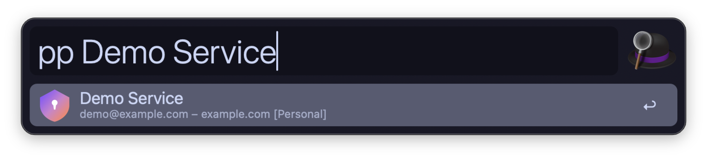

  

<h1 align="center">Proton Pass for Alfred</h1>

  Search and copy credentials from your <a href="https://proton.me/pass">Proton Pass</a> vaults using Alfred.

  

  

## Requirements

- [Alfred Powerpack](https://www.alfredapp.com/powerpack/)
- [pass-cli](https://protonpass.github.io/pass-cli/) — `brew install protonpass/tap/pass-cli`
- Python 3 (macOS built-in)

Optional: `brew install terminal-notifier` for richer notifications.

## Installation

Download the `.alfredworkflow` from [Releases](../../releases) and double-click to import.

## Usage

Type `pp` to search your vault. On first use you'll be prompted to log in via browser.

| Shortcut | Action |
|----------|--------|
| `Enter` | Copy password (clears after 30s)* |
| `Cmd+Enter` | Copy username |
| `Alt+Enter` | Copy TOTP (clears after 30s) |
| `Shift+Enter` | Open URL |

*Copying secrets takes 1-2s as they are fetched on demand from pass-cli and never cached.

All vaults are searched simultaneously. You can optionally assign a hotkey in Alfred's workflow settings.

## Privacy & Security

- **No secrets on disk** — only vault names and website favicons are cached
- **No shell execution** — all external commands use safe argument lists
- **Clipboard auto-clear** — passwords and TOTP codes are removed after 30s
- **No network calls** except to `pass-cli` and a public favicon CDN

## Disclaimer

This is an unofficial, community-maintained project and is not affiliated with, endorsed by, or associated with Proton AG. Proton and Proton Pass are trademarks of Proton AG.

## License

[MIT](LICENSE)
